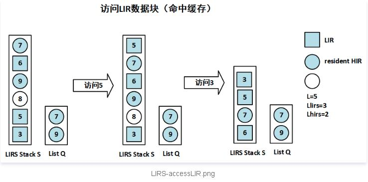
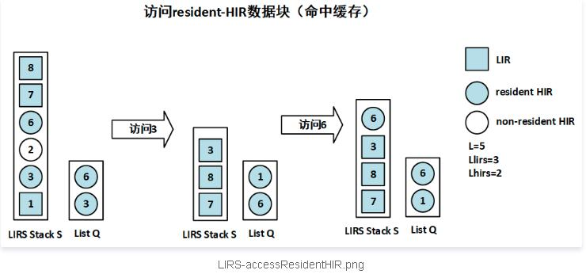
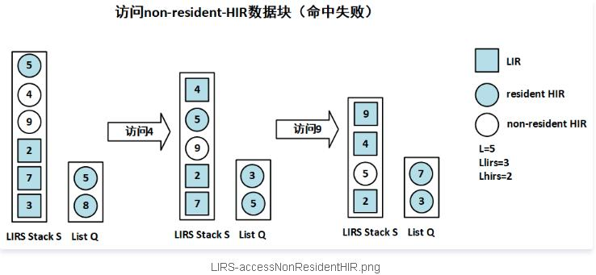
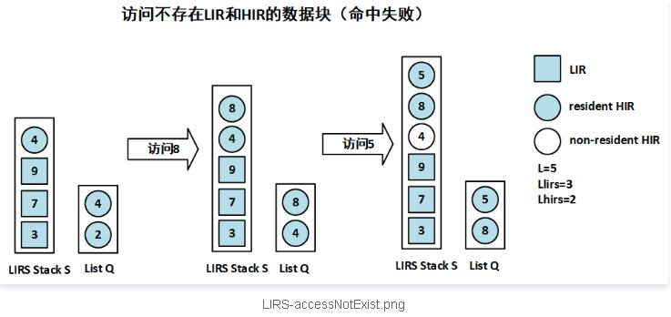

# LIRS

>LIRS caching algorithm, perfect caching, gtests

### Об алгоритмах

#### В данном проекте реализованы *два* алгоритма кэширования:

1. Алгоритм кэширования **LIRS**:

Алгоритм LIRS реализуется с помощью двух структур данных:

   * **LIRS Stack S**: используется для сохранения истории данных, это в основном то же самое, что и реализация алгоритма LRU, но его размер будет изменяться (никакие HIR не могут находиться внизу стека, они при попадании на дно удаляются из стека и остаются только в списке Q)
   
   * **List Q**: используется для сохранения элементов resident HIR, размер фиксирован Lhirs, то есть Q используется для сохранения блоков холодного кэша данных

Элементы алгоритма LIRS могут иметь следующие статусы:  

* *LIR* (HIR, к которому обратились еще раз)
* *resident HIR* (пришедший)
* *non-resident HIR* (вытесненный resident HIR из Q)
* *новые* (все элементы которых нет ни в одной структуре)

Вот несколько изображений, чтобы проиллюстрировать процесс алгоритма LIRS:

1. Обращение к **LIR**  

  

2. Обращение к **resident HIR**  

  

3. Обращение к **non-resident HIR**  

  

4. Обращение к **новому** элементу  

  


2. **Идеальное кэширование** 

При возникновении необходимости вытеснения элемента, вытесняется тот, к которому обратятся позже всех остальных, находящихся в кэше.
Для этого алгоритма нужно сразу иметь список всех запросов.  

3. **Тестирование**

Для обоих алгоритмов осуществено модульное тестирование с помощью библиотеки Google C++ Testing Framework (Google Test)  


### Ввод и вывод

Ввод и вывод обоих алгоритмов:

1. На *входе* размер кэша, количество элементов, затем все элементы
```
3 10
3 4 5 6 4 3 3 2 4 5 3
```

2. На *выходе* количество попаданий
```
For 10 elems (size of cache 3) - 3 hits
```

### Запуск программы

1. Чтобы запустить *алгоритм LIRS* нужно в директории **LIRS**:  
```
  $make  
  $./LIRS.exe  
```
2. Чтобы запустить *тестирование алгоритма LIRS* нужно в директории **LIRS_Test**: 
```
  $ make  
  $./LIRS_Test.exe  
  $cmake -S . -B build
  $cmake --build build  
  $cd build    
  $ctest  
```    
 
3. Чтобы запустить *идеальное кэширование* нужно в директории **Perfect_Cash**: 
``` 
  $make  
  $./Perfect_Cash.exe  
```
